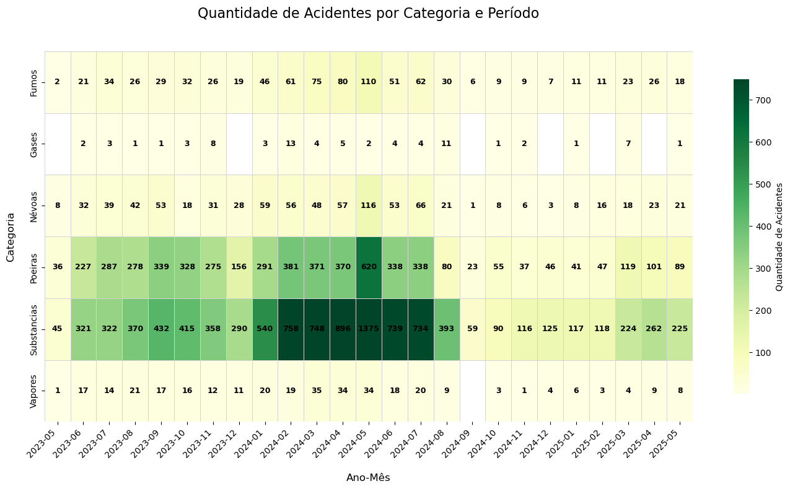
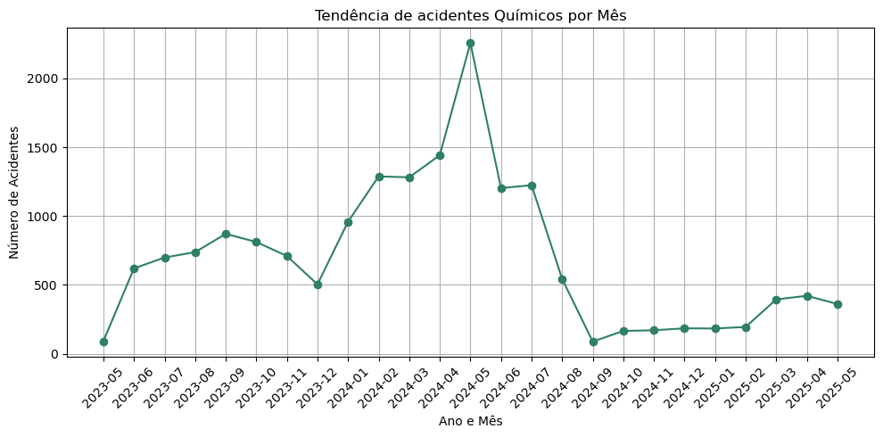

# 📊 RiskData – Análise de Riscos Químicos no Trabalho

Este projeto surgiu a partir de um trabalho acadêmico no **SENAI**, onde curso Mecânica Veicular como aprendiz contratado pela **Mercedes-Benz**.  
A atividade consistia em realizar uma apresentação sobre **Riscos Químicos no Ambiente de Trabalho**. Para complementar o conteúdo, decidi aplicar **Ciência de Dados** para analisar dados reais e criar gráficos que ilustrassem os principais pontos de atenção.  

---

## 🎯 Objetivo
O objetivo do projeto é identificar padrões nos acidentes relacionados a riscos químicos no Brasil, destacando:
- As categorias mais críticas de agentes químicos;
- A tendência temporal de acidentes;
- Possíveis implicações para a segurança do trabalho.

---

## 🗂️ Estrutura do Projeto
- **Introdução teórica** → Conceitos de riscos químicos e agentes envolvidos;  
- **Base de dados** → Comunicação de Acidente de Trabalho (CAT);  
- **Exploração e limpeza dos dados** → Tratamento, categorização e filtros;  
- **Visualizações** → Heatmaps, gráficos de tendência e distribuições;  
- **Conclusões e Insights** → Padrões identificados e recomendações de prevenção.  

---

## 🛠️ Tecnologias Utilizadas
- Python  
- Pandas  
- Matplotlib / Seaborn  
- Jupyter Notebook  

---
## 📊 Principais Visualizações

### Categorias mais críticas de riscos químicos

### Tendência mensal de acidentes químicos

---

## 🔎 Principais Insights
- A categoria **Substâncias químicas** concentrou a maior parte dos acidentes, seguida por **Poeiras**;  
- O pico de acidentes ocorreu em **maio de 2024**, sugerindo possíveis falhas sazonais em protocolos de segurança ou aumento da produção nesse período;  
- Após o pico, houve queda, mas os índices permaneceram acima dos níveis de 2023, reforçando a necessidade de **prevenção contínua**;  
- O uso correto de **EPIs**, aliado a **medidas coletivas de prevenção** (treinamentos, sinalização, protocolos de emergência), é fundamental para reduzir riscos.  

---

## 📌 Conclusão
Este projeto mostrou como a **Ciência de Dados** pode ser aplicada em temas de **Saúde e Segurança do Trabalho**, apoiando tanto **empresas** quanto **órgãos reguladores** na formulação de estratégias mais eficazes.  

---

## 🚀 Próximos Passos
- Expandir a análise para outros tipos de riscos (físicos, biológicos e ergonômicos);  
- Criar dashboards interativos em ferramentas como Power BI ou Plotly;  
- Relacionar os dados com indicadores de saúde ocupacional.  

---

## 👤 Autor
**Rafael Pires Pinho**  
- Aprendiz em Mecânica Veicular na Mercedes-Benz (via SENAI)  
- Estudante de Ciência da Computação  
- Interessado em aplicar **Ciência de Dados e IA** na área de **Saúde e Segurança**  

---

